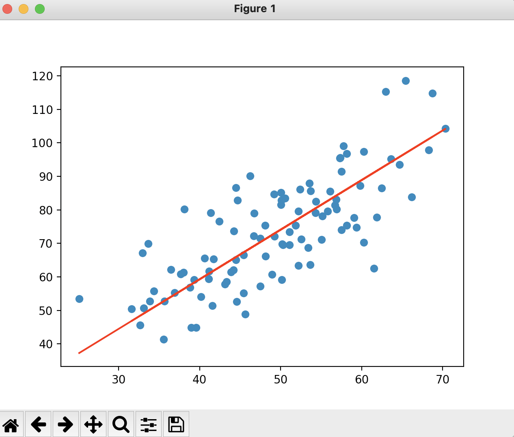

# Linear Regression - Assigment - PGDSB - ISAG

## How to install & run
Run `pip3 install -r requirements.txt`.

Run `python3 main.py`.

## Description
Gabriela Sousa, Maria João Dias and Andreia Aranha developed this project.
The project implements the algorithm of Linear Regression using Gradient Descent to optimize the program. 

#### We created 4 classes:
- `DataInputs` stores data related to the inputs.
- `LinearRegressionParameters` passes the parameters that will impact the Linear Regression calculations.
- `LinearRegressionResults` represents the results of  Gradiant Descendent Algorithm
- `LinearRegression` computes the algorithm.

#### The exit conditions of the LR algorithm are either:
- The maximum iteration in `LinearRegressionParameters.number_of_iteration` is achieved.
- The cost is inferior or equal to the minimal error requested in the `LinearRegressionParameters.minimal_error`.

_**Note:**_
We used the [dataset.csv](./dataset.csv) as an example to apply the algorithm, and got the following result:

```
####### PARAMETERS #######
- number_of_iteration=1000
- learning_rate=0.0001
- minimal_error=1

####### RESULTS #######
lowest cost achieved: 111.01098873556707
final_slope: 1.4796491688889395
final_intercept: 0.10148121494753734
```



### How to run on your own dataset
The method `get_input(file_name)` that reads data from a `.csv` expects a file with only two columns and no header.
The values inside the columns must be of type integer or floating number.
First column must be the independent variable (x) and the second column the dependent variable (y).


## Credits

- https://www.freecodecamp.org/news/how-to-write-a-good-readme-file/
- https://towardsdatascience.com/5-python-best-practices-every-python-programmer-should-follow-3c92971ed370
- https://towardsdatascience.com/linear-regression-using-gradient-descent-in-10-lines-of-code-642f995339c0
- https://towardsdatascience.com/linear-regression-using-gradient-descent-97a6c8700931
